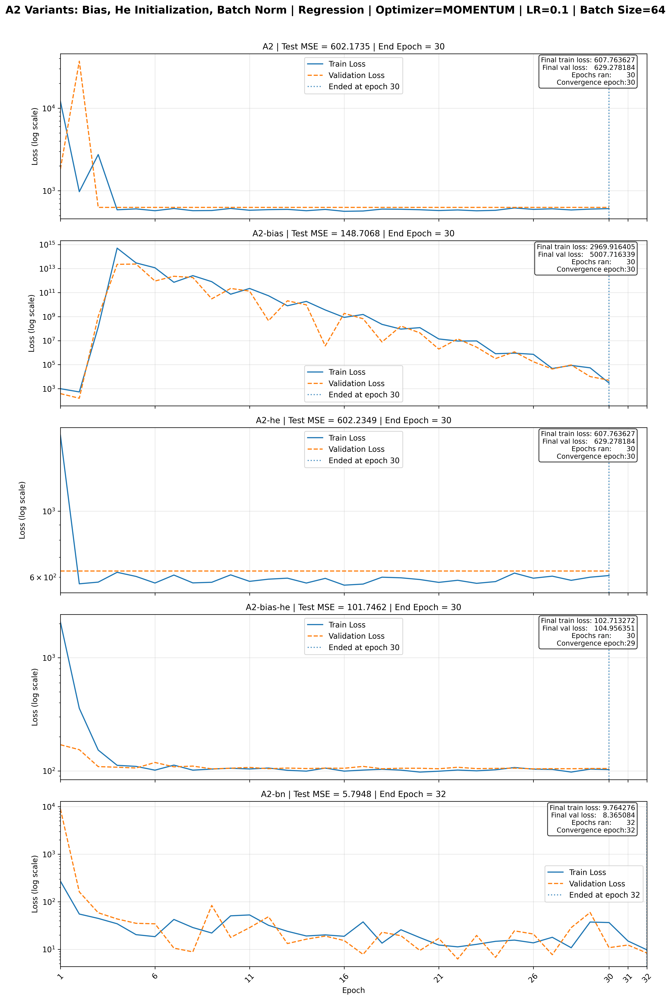
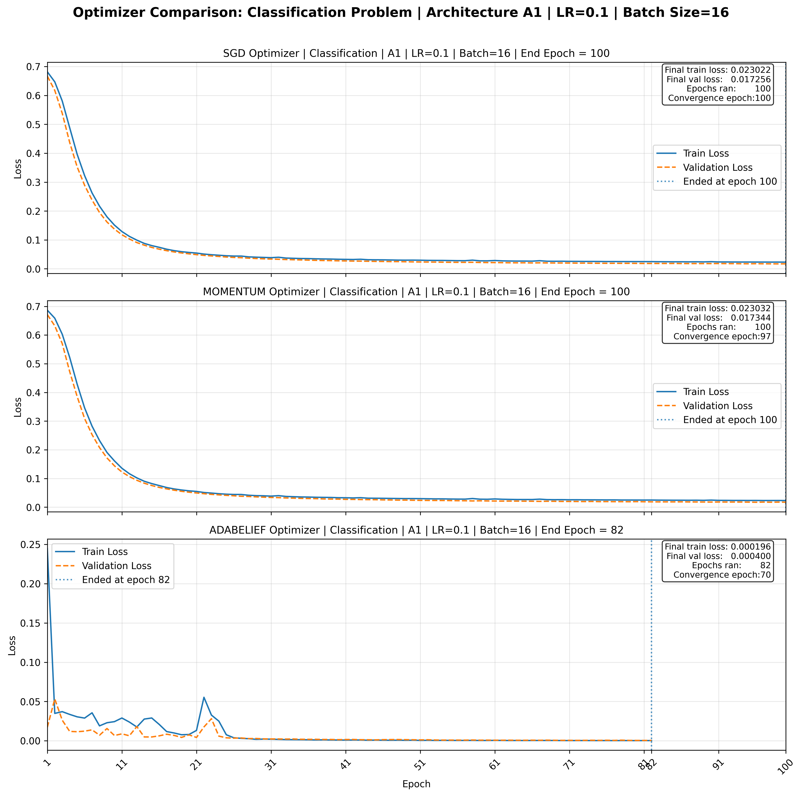
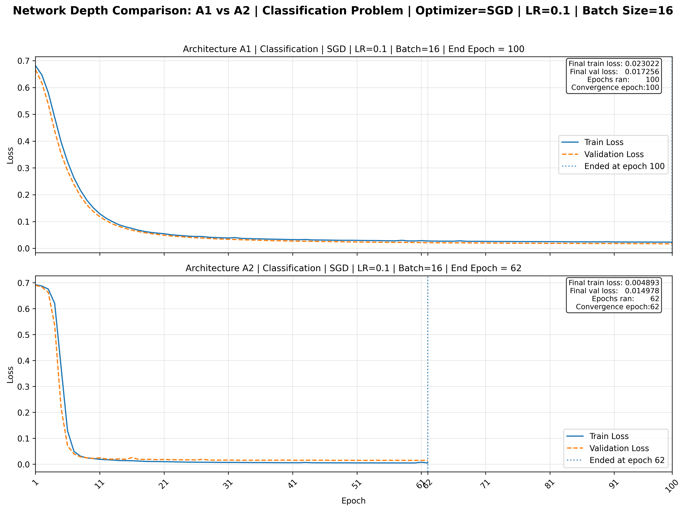
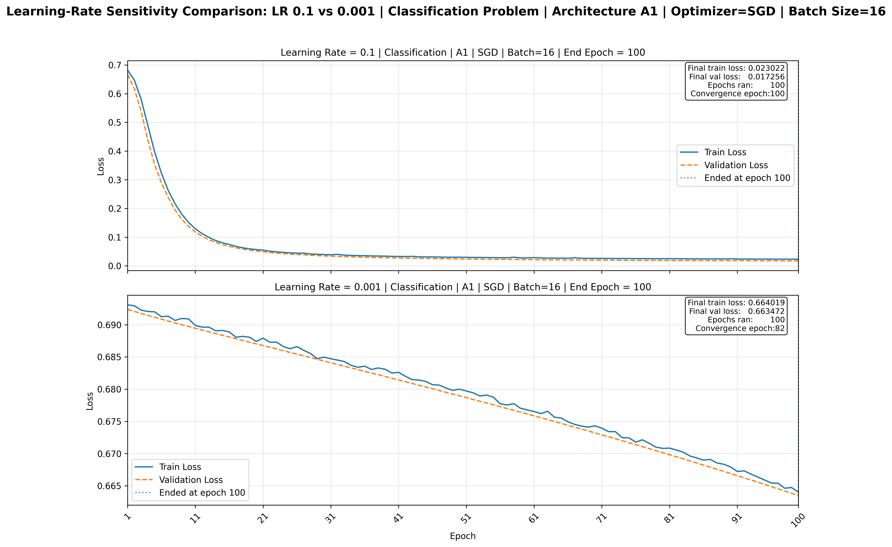

# Neural Network from Scratch in NumPy

A feed-forward neural network built with **NumPy only**, with no TensorFlow, PyTorch or scikit-learn. It includes the forward pass, backpropagation, bias terms, three weight-initialization schemes, batch normalization, dropout, three optimizers, and early stopping. It's applied to two complete examples:

- **Binary classification:** detecting forged banknotes (UCI Banknote Authentication)
- **Regression:** predicting a building's heating load (UCI Energy Efficiency)

Each task is benchmarked across a grid of 8 architectures × 3 optimizers × 2 learning rates × 2 batch sizes, and every configuration is repeated with 5 random seeds: 960 training runs in total.


[](https://github.com/WarmupHero/neural-network-from-scratch/actions/workflows/tests.yml)


---

## Highlights

- **Backprop from first principles.** Dense layers with optional bias terms, ReLU / sigmoid / tanh / linear activations, and BCE / MSE losses (also used as the evaluation metrics), each with a hand-derived backward pass.
- **Batch normalization and dropout.** Batch norm with learned scale and shift and running statistics, and inverted dropout. Both have a separate training and evaluation mode, and the trainer switches the network between them.
- **Weight initialization.** He, Xavier, and a fixed-scale normal initialization, selectable per layer.
- **Three optimizers.** SGD, SGD with momentum, and [AdaBelief](https://arxiv.org/abs/2010.07468) with bias correction. All three update every parameter of every layer: weights, biases, and batch norm's scale and shift.
- **Training loop.** Mini-batching with per-epoch shuffling, validation tracking, early stopping with patience and `min_delta`, restoration of the best model (including batch-norm statistics), and detection of runs whose loss diverges.
- **Verified correctness.** Every analytic gradient (activations, losses, batch norm in both modes, and whole networks with and without bias and batch norm) is checked against central finite differences with `pytest`: 105 tests in total.
- **Multi-seed results.** Every configuration runs with 5 seeds, and each seed changes the data split, the initial weights, the dropout masks and the shuffling. Results are reported as mean ± standard deviation, so they don't rest on one lucky draw.
- **Leak-free preprocessing, also in NumPy.** Duplicates are removed, the data gets a 60 / 20 / 20 train / validation / test split (stratified by class for classification), and the standard scaler is fit on the training split only.
- **Config-driven experiments.** Architectures (including bias, initialization, batch norm and dropout per layer), optimizers, learning rates, batch sizes, seeds and early-stopping settings are defined in JSON. One command runs the whole sweep.

## Results

Models are trained and evaluated with the same objective: **binary cross-entropy (BCE)** for classification and **mean squared error (MSE)** for regression. Lower is better for both.

For each task and seed, the reported model is the run with the **lowest validation loss** among the baseline architectures A1 and A2. Its test score is reported once, and the test set is never used to choose it. The table gives the mean ± standard deviation over the 5 seeds.

| Task | Selected run (most seeds) | Test metric (5 seeds) | Baseline (ignores the features) | Error removed vs. baseline |
|---|---|---|---|---|
| Classification: Banknote Authentication (1,348 unique samples, 4 features) | A1 · AdaBelief · LR 0.1 (all 5 seeds) | **BCE 0.0017 ± 0.0021** | 0.689 (always predict the class proportions) | **99.75% ± 0.31%** |
| Regression: Energy Efficiency → Heating Load (768 samples, 8 features) | A1 · AdaBelief · LR 0.1 · batch 16 (4 of 5 seeds) | **MSE 0.52 ± 0.19** (RMSE ≈ 0.71 kWh/m²) | 90.8–106.2 (always predict the mean; depends on the split) | **99.48% ± 0.18%** (R² ≈ 0.995) |

**Error removed** = 1 − test metric ÷ baseline metric. For regression this is R². For classification it's McFadden's pseudo-R². Raw BCE and MSE are on different scales: BCE is in nats, and MSE is in squared target units, with Heating_Load spanning 6–43. A small BCE next to a larger MSE therefore says nothing about which model is better. Relative to their baselines, both tasks are almost fully solved, on every seed.

When all 8 architectures are allowed, the selection changes for classification. A2 with bias terms (`A2-bias` or `A2-bias-he`) is chosen on 4 of 5 seeds, and `A2-bn-dropout` on the fifth, with a test BCE of 0.00009 ± 0.00013. For regression, A1 is still chosen on 4 of 5 seeds, with an MSE of 0.50 ± 0.20.

The typical run is strong too. Across seeds, the median A1 / A2 run removes 97.2% ± 1.6% of the baseline error on classification and 91.1% ± 0.9% on regression. The weaker runs are the failure modes described below.

*A1* = 1 hidden layer (32 units, sigmoid). *A2* = 3 hidden layers (32 units each, ReLU). The other six architectures are variants of these; see [Architectures](#architectures). Full per-run results are in [`main_summary_20261007-160408.csv`](reports/main_summary_20261007-160408.csv).

### Key findings

- **AdaBelief is the optimizer that is robust to the learning rate.** At LR 0.1, all three optimizers reach a similar classification BCE (about 0.019 averaged over runs and seeds). At LR 0.001, SGD and momentum barely learn: their BCE of 0.681 ± 0.004 is essentially the no-information baseline of 0.689. AdaBelief reaches 0.013 ± 0.007. On regression at LR 0.1, AdaBelief averages an MSE of 2.1 ± 0.8, against 164 and 222 for SGD and momentum, whose deep runs fail (next point).
- **Depth speeds up convergence but makes training fragile.** The 3-layer ReLU network converges in about 41 epochs on classification and 53 on regression, against about 80 and 88 for the shallow one. But on regression at LR 0.1 with SGD or momentum, A2 never learns, across 20 runs (4 settings × 5 seeds). 12 runs **collapse**: the deeper ReLU units all die, and the network outputs a constant at or near 0, giving an MSE of 577–622, matching each split's error for always predicting 0. The other 8 **diverge**, with the loss overflowing to NaN.
- **Batch normalization fixes the collapse; bias terms and He initialization don't.** On those same 20 runs, A2 with batch norm learns in 10 (all momentum runs, test MSE 3.0–9.0). The other 10, all plain SGD, still diverge. With bias terms the dead network can at least output the mean instead of 0, but only 3 of 20 runs learn. He initialization makes the first updates even larger (first-epoch losses up to 1e233) and no runs learn.
- **Bias terms matter most for classification.** Adding biases to A2 lowers the best classification BCE from 0.0057 ± 0.0040 to 0.00014 ± 0.00017. With He initialization as well, it falls to 0.00008 ± 0.00006, the best result of any architecture.
- **Dropout doesn't help here, because nothing overfits.** The gap between training and test metric is tiny (about 0.0002 BCE on classification). With no overfitting to correct, dropout only removes capacity. It wins only 30 of 120 matched classification comparisons and 12 of 110 regression ones.

<p align="center">
  
</p>
<p align="center">
  
</p>
<p align="center">
  
  
</p>

The plots show seed 42. More plots, including the dropout comparison, EDA, scaling comparisons and correlation heatmaps, are in [`reports/`](reports/). The written analysis, including all multi-seed tables, is in [`analysis_20261007-170828.txt`](reports/analysis_20261007-170828.txt).

### Architectures

| Name | Change from its base | What it tests |
|---|---|---|
| `A1` | 1 hidden layer, 32 sigmoid units | baseline |
| `A2` | 3 hidden layers, 32 ReLU units each | baseline (depth) |
| `A2-bias` | A2 + bias terms | does a bias prevent dead ReLUs? |
| `A2-he` | A2 + He initialization | does a ReLU-aware weight scale help? |
| `A2-bias-he` | A2 + both | combined |
| `A2-bn` | A2 + batch norm on each hidden layer | does normalizing the pre-activations fix the collapse? |
| `A1-dropout` | A1 + dropout 0.2 | regularization of the best shallow model |
| `A2-bn-dropout` | A2-bn + dropout 0.2 | regularization of the deep model that learns |

## Quickstart

The project follows the [Cookiecutter Data Science](https://cookiecutter-data-science.drivendata.org/) layout, and a `Makefile` wraps the common commands:

```bash
make create_environment           # python -m venv .venv
make requirements                 # pinned dependencies + the package + dev tools (pytest, ruff)

make train                        # run all 960 experiments (~10 min)
make plots                        # optimizer / depth / learning-rate / variant / dropout plots
make analysis                     # summary report -> reports/analysis_<stamp>.txt
make all                          # train, plots and analysis in one go

make test                         # gradient checks, layer tests, split checks, training tests
make lint                         # check style and lint with ruff (changes nothing)
make format                       # apply ruff's fixes and formatting
make help                         # list every command
```

`make` isn't installed on Windows by default. Install it with `winget install ezwinports.make`, then open a new terminal. Without `make`, run the same steps directly:

```bash
python -m venv .venv
.venv\Scripts\activate            # Windows  (macOS/Linux: source .venv/bin/activate)
pip install -r requirements.txt
pip install -e ".[dev]"

python -m nn_from_scratch.modeling.train   # run all experiments
python -m nn_from_scratch.comparisons      # comparison plots
python -m nn_from_scratch.analysis         # analysis report
python -m pytest                           # tests
```

For a quicker run, set `"seeds": [42]` in both files in `configs/`. That runs the 192 experiments of a single seed in about 2 minutes, and seed 42 reproduces the single-seed results exactly.

Every output file is stamped with the time of the run, as `name_YYYYMMDD-HHMMSS.ext`, so a new run never overwrites an earlier one. `nn_from_scratch.comparisons` and `nn_from_scratch.analysis` use the newest `reports/main_results_full_*.json` by default; pass a path as the first argument to pick a specific one, e.g. `python -m nn_from_scratch.analysis reports/main_results_full_20261007-160408.json`. When run directly (not through `make plots`), set `MPLBACKEND=Agg` to stop plot windows from opening.

Older runs stay on your disk, but only the newest version of each output is committed. Stamped outputs are git-ignored, and a pre-commit hook ([`tools/stage_latest_outputs.py`](tools/stage_latest_outputs.py)) stages the newest ones, untracks older ones, and updates the stamped links in this README. Enable it once per clone with `git config core.hooksPath .githooks`.

## Project structure

```
neural-network-from-scratch/
├── Makefile                     # make train / plots / analysis / test / lint / format / ...
├── pyproject.toml               # package metadata, dev tools, pytest and ruff settings
├── requirements.txt             # pinned runtime dependencies
├── configs/                     # JSON experiment definitions (one per task)
├── data/
│   ├── external/                # (empty) data from third-party sources
│   ├── interim/                 # (empty) intermediate transformed data
│   ├── processed/               # (empty) final datasets for modeling
│   └── raw/                     # the original UCI CSVs, never modified
├── docs/
│   └── DETAILS.md               # detailed documentation
├── models/                      # (empty) trained and serialized models
├── notebooks/                   # (empty) Jupyter notebooks
├── references/                  # (empty) data dictionaries, manuals, papers
├── reports/                     # generated results: summary CSV, full results JSON, analysis
│   ├── comparisons/             # short text analyses next to the comparison plots
│   └── figures/
│       ├── comparisons/         # loss-curve comparison plots
│       └── eda/                 # exploratory and preprocessing plots
├── nn_from_scratch/             # the source package
│   ├── config.py                # paths, default seed, output-file stamping
│   ├── config_loader.py         # loads and validates the JSON configs
│   ├── dataset.py               # downloads the raw datasets
│   ├── features.py              # cleaning, splitting, scaling, EDA
│   ├── scalers.py               # NumPy standard scaler
│   ├── plots.py                 # EDA and preprocessing figures
│   ├── comparisons.py           # optimizer / depth / learning-rate / variant / dropout plots
│   ├── analysis.py              # aggregate analysis report, including multi-seed results
│   ├── nn/                      # the neural-network library
│   │   ├── layers.py            # Dense (bias, initialization), BatchNorm, Dropout
│   │   ├── activations.py       # ReLU, Sigmoid, Tanh, Linear
│   │   ├── losses.py            # BCE, MSE
│   │   ├── metrics.py           # evaluation metrics
│   │   ├── network.py           # model assembly, forward / backward, train / eval mode
│   │   └── optimizers.py        # SGD, Momentum, AdaBelief
│   └── modeling/
│       ├── train.py             # runs the full experiment grid, for every seed
│       └── trainer.py           # training loop, early stopping, divergence detection, evaluation
├── tests/                       # pytest: gradient checks, layers, batch norm, dropout, seeds, training
├── tools/                       # pre-commit helper (newest outputs only) and make help
└── .githooks/                   # the pre-commit hook
```

The empty folders hold a `.gitkeep` file so they exist for future use, as in the template. `configs/`, `tools/`, the `nn/` subpackage and the split of `modeling/` into `train.py` and `trainer.py` are this project's additions to the template.

See the [detailed project documentation](docs/DETAILS.md) for the module-by-module pipeline, everything the JSON configs can and cannot control, how convergence is measured, and how each section of the analysis is computed.

## Demo

Watch the full pipeline run on YouTube: the training script preprocesses the data and trains the experiments, then the analysis script summarizes the results.

[](https://youtu.be/FIBYV5jaxqo)

*The recording predates the latest changes. It shows the original 48-run grid, accuracy / MAE in the console output, and the old folder layout (`main.py`, `src/`). Current results are in [Results](#results).*

## Datasets & attribution

Both datasets come from the UCI Machine Learning Repository and are licensed under [CC BY 4.0](https://creativecommons.org/licenses/by/4.0/). The cached copies in `data/raw/` are unmodified except that the Energy Efficiency columns are renamed to descriptive names.

- Lohweg, V. (2012). *Banknote Authentication* [Dataset]. UCI Machine Learning Repository. https://doi.org/10.24432/C55P57
- Tsanas, A. & Xifara, A. (2012). *Energy Efficiency* [Dataset]. UCI Machine Learning Repository. https://doi.org/10.24432/C51307

## License

The code is released under the [MIT License](LICENSE). The datasets remain under their original CC BY 4.0 licenses (see above).
