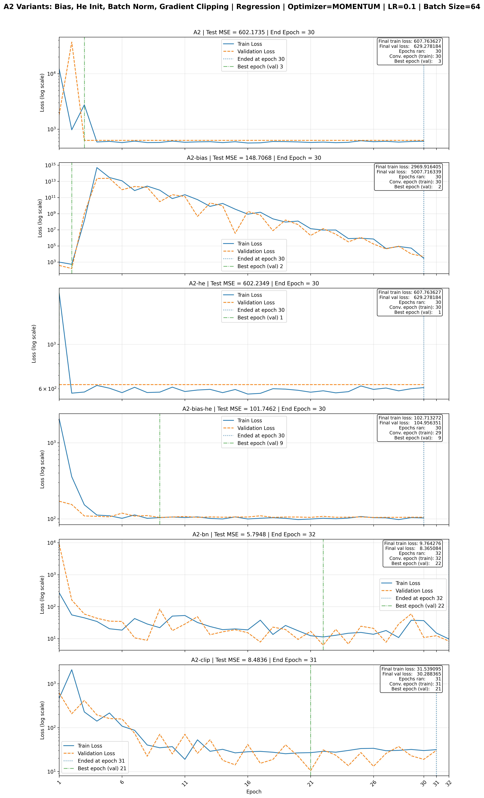
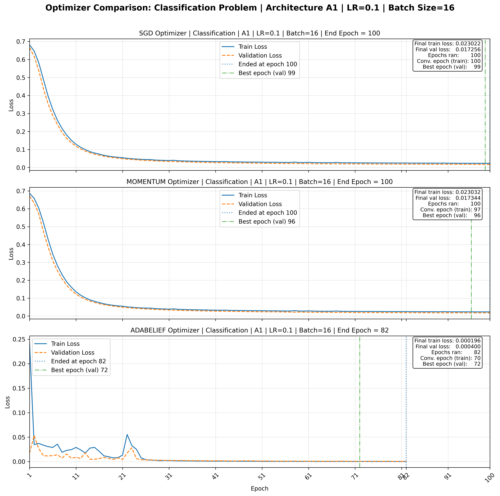
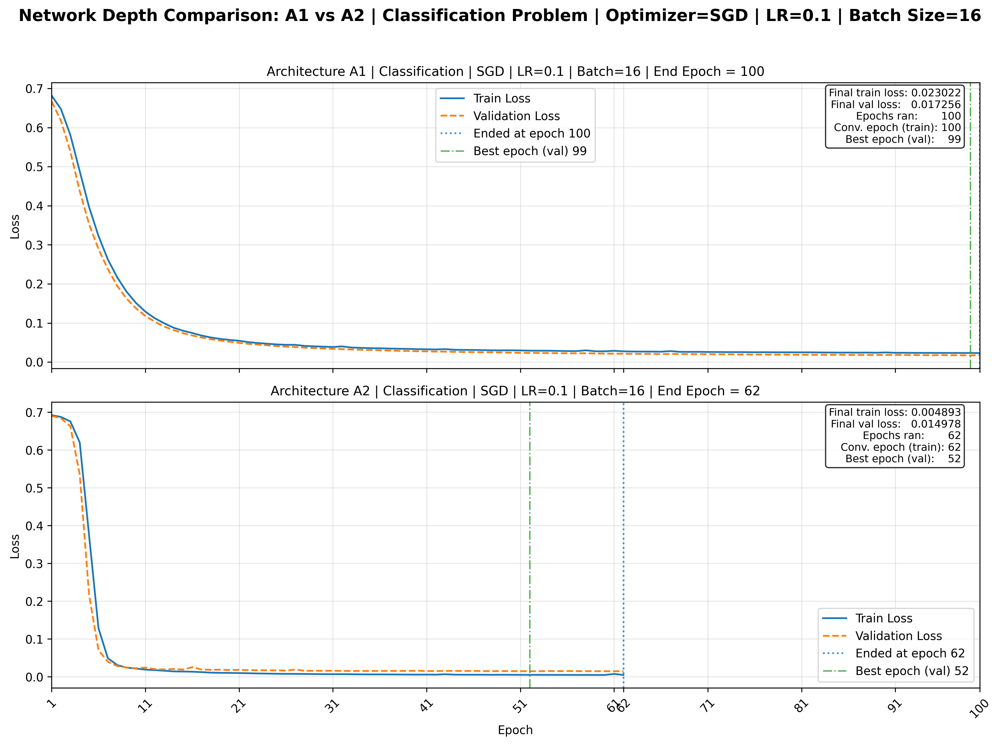
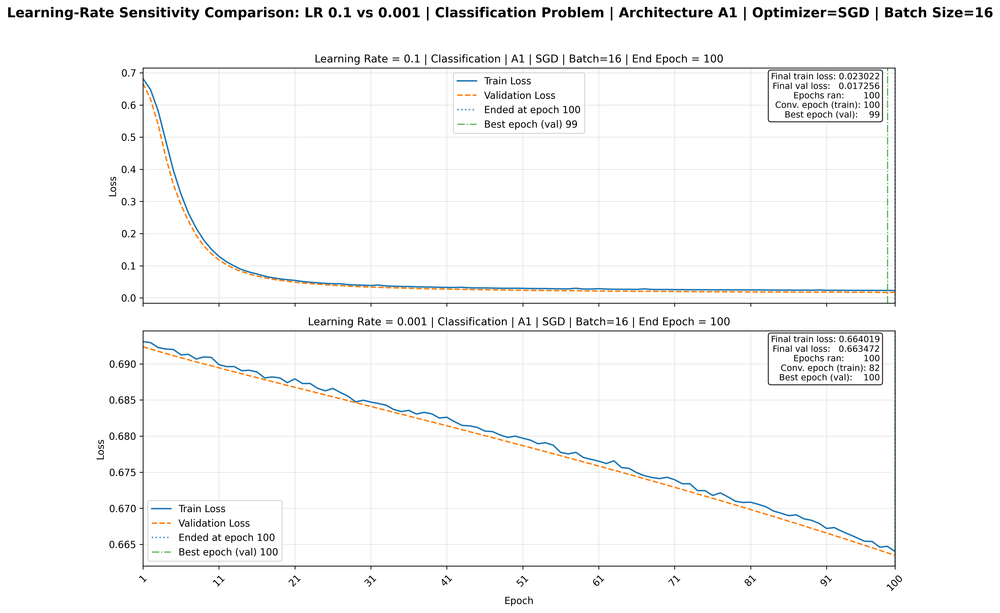
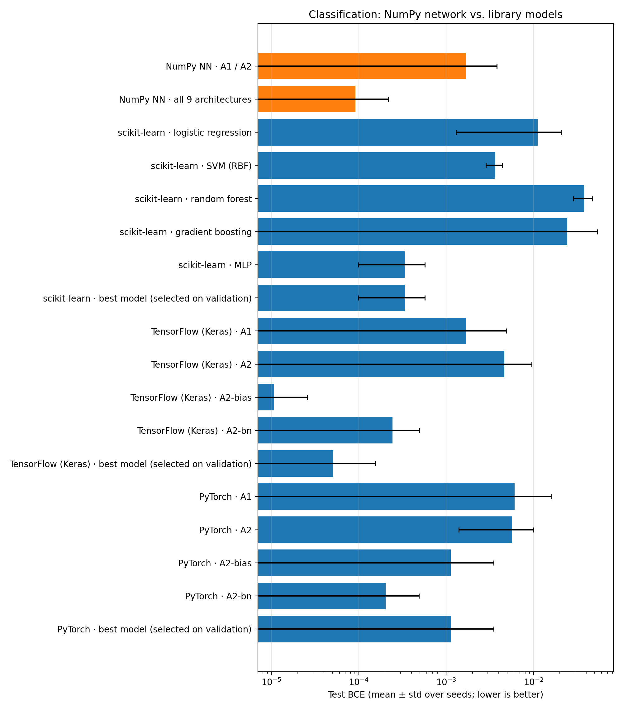
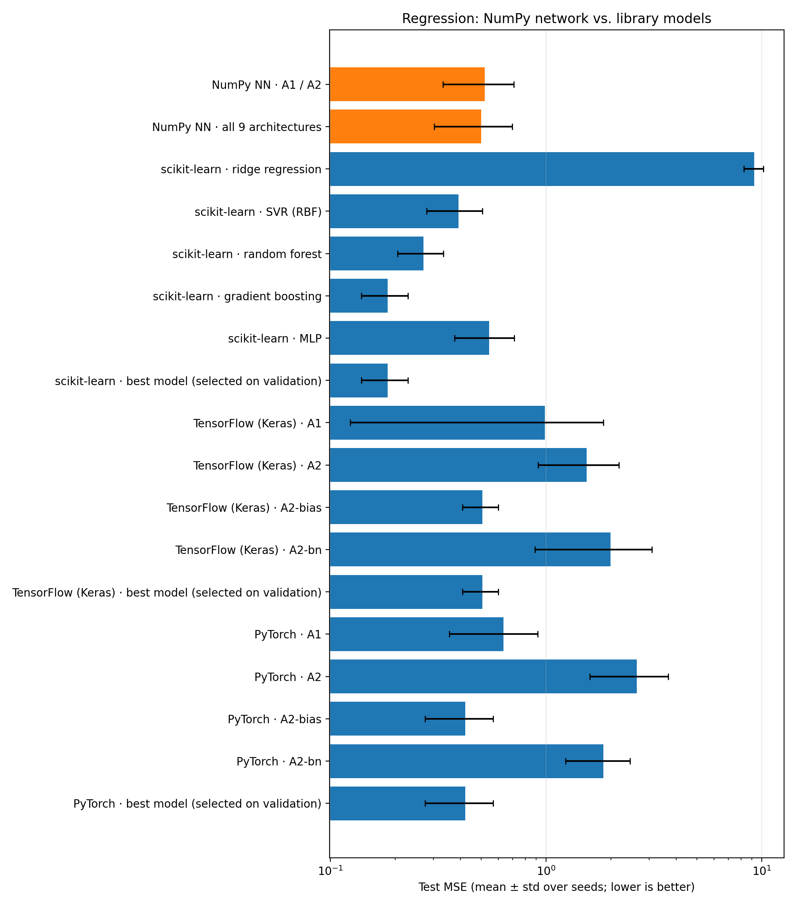
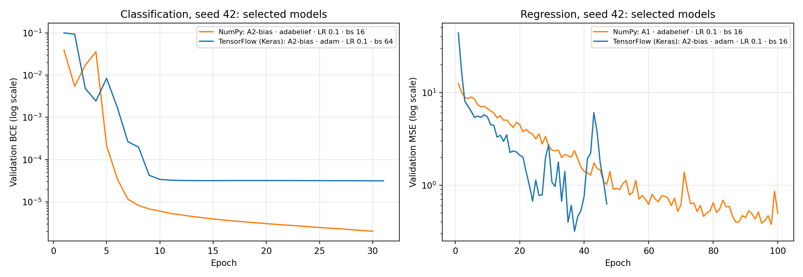
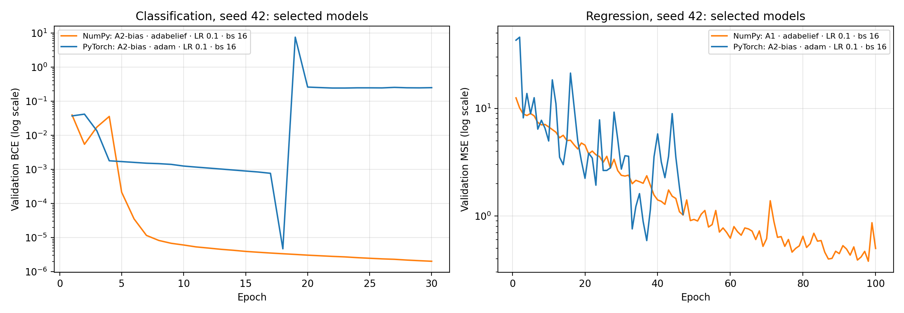

# A NumPy Neural Network vs. scikit-learn, TensorFlow and PyTorch

A feed-forward neural network built with **NumPy only**, with no TensorFlow, PyTorch or scikit-learn. It includes the forward pass, backpropagation, bias terms, three weight-initialization schemes, batch normalization, dropout, three optimizers, and early stopping. It's applied to two complete examples:

- **Binary classification:** detecting forged banknotes (UCI Banknote Authentication)
- **Regression:** predicting a building's heating load (UCI Energy Efficiency)

Each task is benchmarked across a grid of 9 architectures × 3 optimizers × 2 learning rates × 2 batch sizes, and every configuration is repeated with 5 random seeds: 1,080 training runs in total. The results are then [compared with scikit-learn, TensorFlow and PyTorch](#comparison-with-standard-libraries) on exactly the same data.


[](https://github.com/WarmupHero/neural-network-numpy/actions/workflows/tests.yml)


---

## Highlights

- **Backprop from first principles.** Dense layers with optional bias terms, ReLU / sigmoid / tanh / linear activations, and BCE / MSE losses (also used as the evaluation metrics), each with a hand-derived backward pass.
- **Batch normalization and dropout.** Batch norm with learned scale and shift and running statistics, and inverted dropout. Both have a separate training and evaluation mode, and the trainer switches the network between them.
- **Weight initialization.** He, Xavier, and a fixed-scale normal initialization, selectable per layer.
- **Three optimizers.** SGD, SGD with momentum, and [AdaBelief](https://arxiv.org/abs/2010.07468) with bias correction. All three update every parameter of every layer: weights, biases, and batch norm's scale and shift.
- **Training loop.** Mini-batching with per-epoch shuffling, validation tracking, early stopping with patience and `min_delta`, restoration of the best model (including batch-norm statistics), optional global-norm gradient clipping, and detection of runs whose loss diverges. Each run records why it ended (early stopping, epoch limit or divergence) and whether it was starting to overfit.
- **Verified correctness.** Every analytic gradient (activations, losses, batch norm in both modes, and whole networks with and without bias and batch norm) is checked against central finite differences with `pytest`. The suite has 162 tests in total.
- **Multi-seed results.** Every configuration runs with 5 seeds, and each seed changes the data split, the initial weights, the dropout masks and the shuffling. Results are reported as mean ± standard deviation, so they don't rest on one lucky draw.
- **Leak-free preprocessing, also in NumPy.** Duplicates are removed, the data gets a 60 / 20 / 20 train / validation / test split (stratified by class for classification), and the standard scaler is fit on the training split only.
- **Compared with standard practice.** Five scikit-learn models per task, and the same architectures rebuilt in TensorFlow (Keras) and PyTorch, are trained on the same splits and selected by the same validation rule. This puts the NumPy network's results in context.
- **Knowledge base.** The repository itself is described as an OWL ontology in [`knowledge/`](knowledge/), generated from the configs, the sources and the Makefile. Opened in Protégé, its reasoner infers the pipeline order, each module's stage and role, and the architecture families from the asserted nodes and edges; see [Knowledge base](#knowledge-base).
- **Config-driven experiments.** Architectures (including bias, initialization, batch norm and dropout per layer), optimizers, learning rates, batch sizes, seeds and early-stopping settings are defined in JSON. One command runs the whole sweep.

## Results

Models are trained and evaluated with the same objective: **binary cross-entropy (BCE)** for classification and **mean squared error (MSE)** for regression. Lower is better for both.

For each task and seed, the reported model is the run with the **lowest validation loss** among the baseline architectures A1 and A2. Its test score is reported once, and the test set is never used to choose it. The table gives the mean ± standard deviation over the 5 seeds.

| Task | Selected run (most seeds) | Test metric (5 seeds) | Baseline (ignores the features) | Error removed vs. baseline |
|---|---|---|---|---|
| Classification: Banknote Authentication (1,348 unique samples, 4 features) | A1 · AdaBelief · LR 0.1 (all 5 seeds) | **BCE 0.0017 ± 0.0021** | 0.689 (always predict the class proportions) | **99.75% ± 0.31%** |
| Regression: Energy Efficiency → Heating Load (768 samples, 8 features) | A1 · AdaBelief · LR 0.1 · batch 16 (4 of 5 seeds) | **MSE 0.52 ± 0.19** (RMSE ≈ 0.71 kWh/m²) | 90.8–106.2 (always predict the mean; depends on the split) | **99.48% ± 0.18%** (R² ≈ 0.995) |

**Error removed** = 1 − test metric ÷ baseline metric. For regression this is R². For classification it's McFadden's pseudo-R². Raw BCE and MSE are on different scales: BCE is in nats, and MSE is in squared target units, with Heating_Load spanning 6–43. A small BCE next to a larger MSE therefore says nothing about which model is better. Relative to their baselines, both tasks are almost fully solved, on every seed.

When all 9 architectures are allowed, the selection changes for classification. A2 with bias terms (`A2-bias` or `A2-bias-he`) is chosen on 4 of 5 seeds, and `A2-bn-dropout` on the fifth, with a test BCE of 0.00009 ± 0.00013. For regression, A1 is still chosen on 4 of 5 seeds, with an MSE of 0.50 ± 0.20.

The typical run is strong too. Across seeds, the median A1 / A2 run removes 97.2% ± 1.6% of the baseline error on classification and 91.1% ± 0.9% on regression. The weaker runs are the failure modes described below.

*A1* = 1 hidden layer (32 units, sigmoid). *A2* = 3 hidden layers (32 units each, ReLU). The other seven architectures are variants of these; see [Architectures](#architectures). Full per-run results are in [`main_summary_20261008-220824.csv`](reports/main_summary_20261008-220824.csv).

### Key findings

- **AdaBelief is the optimizer that is robust to the learning rate.** At LR 0.1, all three optimizers reach a similar classification BCE (about 0.019 averaged over runs and seeds). At LR 0.001, SGD and momentum barely learn: their BCE of 0.681 ± 0.004 is essentially the no-information baseline of 0.689. AdaBelief reaches 0.013 ± 0.007. On regression at LR 0.1, AdaBelief averages an MSE of 2.1 ± 0.8, against 164 and 222 for SGD and momentum, whose deep runs fail (next point).
- **Depth speeds up convergence but makes training fragile.** The 3-layer ReLU network's training loss settles in about 41 epochs on classification and 53 on regression, against about 80 and 88 for the shallow one. The validation-selected checkpoint comes earlier too: epoch 62 and 42, against 91 and 86. But on regression at LR 0.1 with SGD or momentum, A2 never learns, across 20 runs (4 settings × 5 seeds). 12 runs **collapse**: the deeper ReLU units all die, and the network outputs a constant at or near 0, giving an MSE of 577–622, matching each split's error for always predicting 0. The other 8 **diverge**, with the loss overflowing to NaN.
- **Batch normalization fixes the collapse; bias terms and He initialization don't.** On those same 20 runs, A2 with batch norm learns in 10 (all momentum runs, test MSE 3.0–9.0). The other 10, all plain SGD, still diverge. With bias terms the dead network can at least output the mean instead of 0, but only 3 of 20 runs learn. He initialization makes the first updates even larger (first-epoch losses up to 1e233) and no runs learn.
- **Gradient clipping prevents both failure modes, at a cost.** The recorded gradient norms show the cause: every diverged run's gradient norm exceeds 1,000 in its first epoch, and 37 of the 55 overflow outright, so one huge step either kills the ReLUs or overflows the loss. Capping the global gradient norm at 20 (`A2-clip`) stops every divergence: on the same 20 regression runs, 18 learn and 2 collapse. With momentum they reach a test MSE of 5–14; with plain SGD the capped steps leave them far behind (63–110). The cap also slows the healthy runs: A2's best regression result per seed worsens from 1.79 ± 0.80 to 4.48 ± 2.41, mostly because AdaBelief at LR 0.1 is held back. On classification, 57 of 60 runs are unchanged.
- **Bias terms matter most for classification.** Adding biases to A2 lowers the best classification BCE from 0.0057 ± 0.0040 to 0.00014 ± 0.00017. With He initialization as well, it falls to 0.00008 ± 0.00006, the best result of any architecture.
- **Dropout doesn't help here, because almost nothing overfits.** Of the 515 runs that early stopping ended, only 54 (10%) showed the overfitting signature, training loss still improving while validation loss wasn't; the rest stopped on a plateau, and 390 runs used all 100 epochs. The gap between test and training metric of the models selected per seed is tiny: at most 0.004 BCE on classification (averaged per architecture), and 0.16 MSE for A1 on regression, against a baseline of about 100. With no overfitting to correct, dropout only removes capacity. It wins only 30 of 120 matched classification comparisons and 12 of 110 regression ones.

<p align="center">
  
</p>
<p align="center">
  
</p>
<p align="center">
  
  
</p>

The plots show seed 42. More plots, including the dropout comparison, EDA, scaling comparisons and correlation heatmaps, are in [`reports/`](reports/). The written analysis, including all multi-seed tables, is in [`analysis_20261008-222044.txt`](reports/analysis_20261008-222044.txt).

### Architectures

| Name | Change from its base | What it tests |
|---|---|---|
| `A1` | 1 hidden layer, 32 sigmoid units | baseline |
| `A2` | 3 hidden layers, 32 ReLU units each | baseline (depth) |
| `A2-bias` | A2 + bias terms | does a bias prevent dead ReLUs? |
| `A2-he` | A2 + He initialization | does a ReLU-aware weight scale help? |
| `A2-bias-he` | A2 + both | combined |
| `A2-bn` | A2 + batch norm on each hidden layer | does normalizing the pre-activations fix the collapse? |
| `A1-dropout` | A1 + dropout 0.2 | regularization of the best shallow model |
| `A2-bn-dropout` | A2-bn + dropout 0.2 | regularization of the deep model that learns |
| `A2-clip` | A2 + gradient-norm clipping at 20 | does capping the update size prevent the explosion? |

## Comparison with standard libraries

How does a network written in plain NumPy compare with standard practice? Two comparisons answer this:

- **scikit-learn:** five model families per task (linear, SVM, random forest, gradient boosting, MLP).
- **TensorFlow (Keras) and PyTorch:** the network's own architectures A1, A2, A2-bias and A2-bn, rebuilt layer for layer.

Every library model was trained on **exactly the same splits** (same 5 seeds), scored with **the same NumPy metric functions**, and selected with **the same rule**: for every model, the configuration with the lowest validation loss on each seed, then its test score. The network itself stays NumPy-only; the libraries are an optional install used only for these comparisons.

### Against scikit-learn

The table also lists each framework's best model; the next section compares the frameworks architecture by architecture.

| Model | Classification: test BCE | Accuracy | Regression: test MSE | R² |
|---|---|---|---|---|
| **NumPy NN, A1 / A2** | 0.0017 ± 0.0021 | 100% | 0.52 ± 0.19 | 0.995 |
| **NumPy NN, all 9 architectures** | **0.00009 ± 0.00013** | 100% | 0.50 ± 0.20 | 0.995 |
| scikit-learn MLP | 0.00033 ± 0.00023 | 100% | 0.54 ± 0.17 | 0.994 |
| scikit-learn SVM / SVR (RBF) | 0.0036 ± 0.0008 | 100% | 0.39 ± 0.11 | 0.996 |
| scikit-learn gradient boosting | 0.024 ± 0.030 | 99.5% | **0.18 ± 0.04** | **0.998** |
| scikit-learn random forest | 0.038 ± 0.009 | 99.4% | 0.27 ± 0.06 | 0.997 |
| scikit-learn logistic / ridge regression | 0.011 ± 0.010 | 99.6% | 9.21 ± 0.96 | 0.908 |
| TensorFlow (Keras), best of A1 / A2 / A2-bias / A2-bn | **0.00005 ± 0.00010** | 100% | 0.51 ± 0.10 | 0.995 |
| PyTorch, best of A1 / A2 / A2-bias / A2-bn | 0.0011 ± 0.0024 | 99.9% | 0.42 ± 0.15 | 0.996 |

Mean ± standard deviation over 5 seeds. Lower BCE / MSE is better, and higher accuracy / R² is better.

- **Classification: the NumPy network wins.** Allowing all 9 architectures, it has the lowest test BCE of any model and beats scikit-learn's best model (its MLP, chosen on every seed) on 4 of 5 seeds. Every neural network and the SVM classify the test set perfectly; the BCE differences are about how confident the correct predictions are.
- **Regression: tree ensembles win.** Gradient boosting has about a third of the network's error (MSE 0.18 vs. 0.50) and beats it on all 5 seeds. Random forest and SVR also do better. Tree models suit this dataset, whose 8 building features each take only 2 to 12 distinct values.
- **The NumPy network matches scikit-learn's own neural network.** On regression, its MSE (0.52 for A1 / A2) is in line with scikit-learn's MLP (0.54), which suggests the implementation performs like a standard library one.
- **Training cost is comparable.** The selected configurations train in about 0.2–0.5 s for the NumPy network and from a few milliseconds to 1.2 s for the scikit-learn models, per seed, on one CPU.

### Against TensorFlow and PyTorch: same architecture, different implementation

Each architecture was rebuilt in Keras and in PyTorch and trained over the same grid shape: 3 optimizers × 2 learning rates (0.1, 0.001) × 2 batch sizes (16, 64), up to 100 epochs with early stopping. The optimizers deliberately don't match: each framework uses what it provides (SGD, classical momentum, **Adam**), and the NumPy network uses its own (SGD, moving-average momentum, **AdaBelief**). The frameworks also keep their own defaults for weight initialization and batch norm, and compute in float32. PyTorch has no built-in training loop, so its loop is written out and uses the NumPy trainer's exact early-stopping rule. The full list of differences is in [`docs/DETAILS.md`](docs/DETAILS.md#4-library-comparison).

| Architecture | Classification BCE: NumPy | Keras | PyTorch | Regression MSE: NumPy | Keras | PyTorch |
|---|---|---|---|---|---|---|
| `A1` | **0.0017 ± 0.0021** | **0.0017 ± 0.0032** | 0.0061 ± 0.0100 | **0.52 ± 0.19** | 0.98 ± 0.86 | 0.63 ± 0.28 |
| `A2` | 0.0057 ± 0.0040 | **0.0046 ± 0.0049** | 0.0057 ± 0.0043 | 1.79 ± 0.80 | **1.54 ± 0.63** | 2.64 ± 1.04 |
| `A2-bias` | 0.00014 ± 0.00017 | **0.00001 ± 0.00001** | 0.0011 ± 0.0024 | 0.70 ± 0.18 | 0.51 ± 0.10 | **0.42 ± 0.15** |
| `A2-bn` | 0.00029 ± 0.00023 | 0.00024 ± 0.00025 | **0.00020 ± 0.00028** | **1.44 ± 0.28** | 1.99 ± 1.10 | 1.84 ± 0.61 |

Each cell is the best configuration per seed (selected on validation), mean ± standard deviation over 5 seeds. Lower is better; the best implementation per row and task is in bold.

- **No implementation is consistently better.** Pairing them seed by seed, the NumPy network has the lower test error than Keras in 17 of the 40 architecture-and-seed comparisons, and than PyTorch in 20 of 40. Most gaps are within the spread across seeds, and the best architecture differs between implementations. Selecting over all their architectures, the NumPy network's best model beats Keras's best on 2 of 5 classification seeds and 4 of 5 regression seeds, and beats PyTorch's best on 3 of 5 and 2 of 5.
- **The NumPy network's failure mode is real, not a bug.** In the NumPy network, the deep ReLU network on regression at LR 0.1 never learns with SGD or momentum: 8 runs diverge and 12 collapse to a constant output (test MSE 577–622). PyTorch reproduces this almost exactly: of its 20 A2 runs at those settings, 10 diverge and 10 collapse to the same MSE range of 577–622. In Keras, 19 diverge and 1 collapses.
- **Here the NumPy network's batch norm does better than the frameworks'.** In the NumPy network, batch norm lets the momentum runs at LR 0.1 learn. In both frameworks, all 20 A2-bn runs at those settings diverge, and so do all 20 A2-bias runs. PyTorch's batch norm has the same settings as the NumPy one, so the likely cause is the momentum rule: the frameworks' classical momentum takes steps about 10× larger than the NumPy network's moving average at the same learning rate.
- **Adam plays the role of AdaBelief.** No Adam run diverged in either framework. Adam at LR 0.1 is the selected configuration in 30 of 40 selections in Keras and 29 of 40 in PyTorch, just as AdaBelief at LR 0.1 dominates the NumPy network's selections. It's less smooth, though. In the PyTorch curves below, Adam's validation loss jumps from 0.000005 to 7.5 at epoch 19, and early stopping restores the epoch-18 checkpoint.
- **The frameworks are slower on data this small.** A selected model takes 0.2–0.5 s to train in the NumPy network, 0.6–1.6 s in PyTorch, and 4–13 s in Keras. With a few hundred training samples, each step is tiny, and per-step framework overhead dominates; Keras's `fit()` adds the most. The 480 runs took 9 minutes in PyTorch and 81 in Keras on one CPU; the NumPy network's 1,080 runs take about 11.

<p align="center">
  
  
</p>
<p align="center">
  
</p>
<p align="center">
  
</p>

The bar charts include every library model and each framework architecture. The curves show the selected NumPy and framework models on seed 42. The full tables, the configuration each model selected most often and the seed-by-seed head-to-heads are in [`benchmark_report_20261009-134829.txt`](reports/benchmark_report_20261009-134829.txt).

### Limitations

These comparisons show that a NumPy network can match standard libraries on these two tasks. They don't show that it's better in general.

- **Small, nearly solved datasets.** The test sets have 270 and 154 samples, and the best neural networks reach about 100% accuracy and an R² of about 0.995. Most differences between neural networks are within the variation across the 5 seeds, and no significance tests were run.
- **Not equally tuned.** The grid (learning rates, batch sizes, early stopping) and the architectures were designed around the NumPy network. The frameworks run with their default initialization, optimizers and batch-norm settings, without per-framework tuning such as learning-rate schedules or weight decay.
- **Unequal search space.** The NumPy network's best model is selected from 9 architectures, while each framework's comes from 4. Choosing among more candidates is an advantage on its own.
- **Different optimizers and precision.** The NumPy network uses AdaBelief, moving-average momentum and float64; the frameworks use Adam, classical momentum and float32.
- **Timing is specific to this setup.** Times were measured on one CPU with small layers and batches, where each framework's per-step overhead dominates. On larger data, larger models or a GPU, the frameworks are much faster.
- **Two datasets.** The results shouldn't be generalized beyond these two UCI tasks.

## Quickstart

The project follows the [Cookiecutter Data Science](https://cookiecutter-data-science.drivendata.org/) layout, and a `Makefile` wraps the common commands:

```bash
make create_environment           # python -m venv .venv
make requirements                 # pinned dependencies + the package + dev tools (pytest, ruff)

make train                        # run all 1,080 experiments (~11 min)
make plots                        # optimizer / depth / learning-rate / variant / dropout plots
make analysis                     # summary report -> reports/analysis_<stamp>.txt
make all                          # train, plots and analysis in one go

make benchmark-requirements       # optional: scikit-learn, TensorFlow, PyTorch
make benchmarks                   # train the library models on the same splits (scikit-learn ~1 min, PyTorch ~9, TensorFlow ~80)
make benchmark-report             # comparison report -> reports/benchmark_report_<stamp>.txt

make knowledge-base               # OWL ontology of the repo -> knowledge/nn_numpy.owl (open in Protégé)

make test                         # gradient checks, layer tests, split checks, training tests
make lint                         # check style and lint with ruff (changes nothing)
make format                       # apply ruff's fixes and formatting
make help                         # list every command
```

`make` isn't installed on Windows by default. Install it with `winget install ezwinports.make`, then open a new terminal. Without `make`, run the same steps directly:

```bash
python -m venv .venv
.venv\Scripts\activate            # Windows  (macOS/Linux: source .venv/bin/activate)
pip install -r requirements.txt
pip install -e ".[dev]"

python -m nn_numpy.modeling.train   # run all experiments
python -m nn_numpy.comparisons      # comparison plots
python -m nn_numpy.analysis         # analysis report
python -m pytest                           # tests

pip install -e ".[benchmarks]"             # optional: scikit-learn, TensorFlow, PyTorch
python -m nn_numpy.benchmarks.run   # library comparison (or one: ... run sklearn / tensorflow / pytorch)
python -m nn_numpy.benchmarks.report
```

For a quicker run, set `"seeds": [42]` in both files in `configs/`. That runs the 216 experiments of a single seed in about 2 minutes, and seed 42 reproduces the single-seed results exactly.

Every output file is stamped with the time of the run, as `name_YYYYMMDD-HHMMSS.ext`, so a new run never overwrites an earlier one. `nn_numpy.comparisons` and `nn_numpy.analysis` use the newest `reports/main_results_full_*.json` by default; pass a path as the first argument to pick a specific one, e.g. `python -m nn_numpy.analysis reports/main_results_full_20261008-220824.json`. When run directly (not through `make plots`), set `MPLBACKEND=Agg` to stop plot windows from opening.

Older runs stay on your disk, but only the newest version of each output is committed. Stamped outputs are git-ignored, and a pre-commit hook ([`tools/stage_latest_outputs.py`](tools/stage_latest_outputs.py)) stages the newest ones, untracks older ones, and updates the stamped links in this README. Enable it once per clone with `git config core.hooksPath .githooks`.

## Project structure

```
neural-network-numpy/
├── Makefile                     # make train / plots / analysis / test / lint / format / ...
├── pyproject.toml               # package metadata, dev tools, pytest and ruff settings
├── requirements.txt             # pinned runtime dependencies
├── configs/                     # JSON experiment definitions (one per task) and the library comparison's models
├── data/
│   ├── external/                # (empty) data from third-party sources
│   ├── interim/                 # (empty) intermediate transformed data
│   ├── processed/               # (empty) final datasets for modeling
│   └── raw/                     # the original UCI CSVs, never modified
├── docs/
│   └── DETAILS.md               # detailed documentation
├── knowledge/                   # knowledge base (OWL, for Protégé) and architecture diagram (Obsidian)
│   ├── nn_numpy.owl             # the knowledge base, generated by tools/build_knowledge_base.py
│   ├── extensions.owl           # imports the knowledge base; put manual additions here
│   └── nn-architecture.canvas   # visual representation of the repository, not a knowledge base
├── models/                      # (empty) trained and serialized models
├── notebooks/                   # (empty) Jupyter notebooks
├── references/                  # (empty) data dictionaries, manuals, papers
├── reports/                     # generated results: summary CSV, full results JSON, analysis
│   ├── comparisons/             # short text analyses next to the comparison plots
│   └── figures/
│       ├── benchmarks/          # NumPy network vs. scikit-learn, TensorFlow, PyTorch
│       ├── comparisons/         # loss-curve comparison plots
│       └── eda/                 # exploratory and preprocessing plots
├── nn_numpy/                    # the source package
│   ├── config.py                # paths, default seed, output-file stamping
│   ├── config_loader.py         # loads and validates the JSON configs
│   ├── dataset.py               # downloads the raw datasets
│   ├── features.py              # cleaning, splitting, scaling, EDA
│   ├── scalers.py               # NumPy standard scaler
│   ├── plots.py                 # EDA and preprocessing figures
│   ├── comparisons.py           # optimizer / depth / learning-rate / variant / dropout plots
│   ├── analysis.py              # aggregate analysis report, including multi-seed results
│   ├── benchmarks/              # comparison with scikit-learn, TensorFlow and PyTorch on the same splits (optional)
│   │   ├── data.py              # the main pipeline's exact splits, per seed
│   │   ├── sklearn_models.py    # scikit-learn models and their grids
│   │   ├── keras_models.py      # the network's architectures rebuilt in Keras
│   │   ├── torch_models.py      # ... and in PyTorch, with a hand-written training loop
│   │   ├── run.py               # trains the library models
│   │   └── report.py            # comparison tables and figures
│   ├── nn/                      # the neural-network library
│   │   ├── layers.py            # Dense (bias, initialization), BatchNorm, Dropout
│   │   ├── activations.py       # ReLU, Sigmoid, Tanh, Linear
│   │   ├── losses.py            # BCE, MSE
│   │   ├── metrics.py           # evaluation metrics
│   │   ├── network.py           # model assembly, forward / backward, train / eval mode
│   │   └── optimizers.py        # SGD, Momentum, AdaBelief
│   └── modeling/
│       ├── train.py             # runs the full experiment grid, for every seed
│       └── trainer.py           # training loop, early stopping, divergence detection, evaluation
├── tests/                       # pytest: gradient checks, layers, batch norm, dropout, seeds, training, metrics, benchmarks
├── tools/                       # pre-commit helper (newest outputs only), make help, knowledge-base builder
└── .githooks/                   # the pre-commit hook
```

The empty folders hold a `.gitkeep` file so they exist for future use, as in the template. `configs/`, `tools/`, the `nn/` subpackage and the split of `modeling/` into `train.py` and `trainer.py` are this project's additions to the template.

See the [detailed project documentation](docs/DETAILS.md) for the module-by-module pipeline, everything the JSON configs can and cannot control, how convergence is measured, and how each section of the analysis is computed.

## Knowledge base

The [`knowledge/`](knowledge/) folder holds two kinds of description of this repository: an OWL ontology that is its **knowledge base**, and a diagram that is only a **visual representation** of it.

| File | What it is | Open with |
|---|---|---|
| [`nn_numpy.owl`](knowledge/nn_numpy.owl) | **The knowledge base.** An OWL 2 ontology describing the repository as nodes and edges: every module, package, artifact (configs, datasets, result files, reports, figures) and make target, what each reads, writes, imports, runs and belongs to, and the concepts the code implements: tasks, the nine architectures and their techniques, optimizers, losses, metrics, the experiment grid, the libraries and the comparison's library models. Result files are described by the module that writes them, where they are saved and what they contain; no result numbers are stored. | [Protégé](https://protege.stanford.edu/) 5.5 |
| [`extensions.owl`](knowledge/extensions.owl) | **Your additions to the knowledge base.** It imports `nn_numpy.owl`, so Protégé shows both as one ontology. Add classes, individuals or axioms here, never in the generated file. | Protégé |
| [`nn-architecture.canvas`](knowledge/nn-architecture.canvas) | **A visual representation of the repository**, not a knowledge base: one box per component, grouped into coloured stages, with arrows for what feeds what. It holds no logic for a reasoner. The ontology's individuals carry the ids of these boxes (`canvasNodeId`), so the two can be matched. | [Obsidian](https://obsidian.md/) |

**How the knowledge base works.** Only direct facts are asserted, such as "train.py writes the results JSON" or "analysis.py reads it". The reasoner (HermiT in Protégé) infers the rest:
- **Pipeline order:** `feeds` (from writes ∘ readBy) and its transitive closure `upstreamOf`, e.g. everything upstream of the benchmark report.
- **Stages:** a module's stage, from its package (partOf ∘ belongsToStage).
- **Roles:** producers, consumers, pipeline steps, entry points, optional modules, tested modules, stamped artifacts.
- **Architecture families:** variants, deep or shallow, normalized, regularized, clipped, with bias.
- **Framework rebuilds:** which library models rebuild the network's own architectures.

Every object property has an inverse. The ones that fit are transitive (`upstreamOf`, `partOf`, `variantOf`), functional or inverse functional (e.g. each artifact is written by one module), symmetric (`frameworkCounterpartOf`, which links the Keras and PyTorch rebuilds of the same architecture), asymmetric (every directed edge, so an edge entered backwards makes the ontology inconsistent) or irreflexive (`imports`).

**Using it.** Open `nn_numpy.owl` in Protégé and start the reasoner (Reasoner → HermiT). To see inferred edges on an individual, tick *Object property assertions* under Reasoner → Configure. DL queries such as `Component and upstreamOf value BenchmarkReport` or `Architecture and usesTechnique some GradientClipping` answer questions about the repository.

**Keeping it current.** `nn_numpy.owl` is generated from the repository by [`tools/build_knowledge_base.py`](tools/build_knowledge_base.py) (`make knowledge-base`): architectures and grid from the configs, modules and imports from the sources, targets from the Makefile, libraries from `pyproject.toml`. Re-run it after changing any of these; the output is deterministic, so an unchanged repository gives an unchanged file. The tests check that the file is valid OWL 2 DL and that the intended inferences hold. More detail is in [DETAILS.md](docs/DETAILS.md#5-knowledge-base).

## Demo

Watch the full pipeline run on YouTube: the training script preprocesses the data and trains the experiments, then the analysis script summarizes the results.

[](https://youtu.be/FIBYV5jaxqo)

*The recording predates the latest changes. It shows the original 48-run grid, accuracy / MAE in the console output, and the old folder layout (`main.py`, `src/`). Current results are in [Results](#results).*

## Datasets & attribution

Both datasets come from the UCI Machine Learning Repository and are licensed under [CC BY 4.0](https://creativecommons.org/licenses/by/4.0/). The cached copies in `data/raw/` are unmodified except that the Energy Efficiency columns are renamed to descriptive names.

- Lohweg, V. (2012). *Banknote Authentication* [Dataset]. UCI Machine Learning Repository. https://doi.org/10.24432/C55P57
- Tsanas, A. & Xifara, A. (2012). *Energy Efficiency* [Dataset]. UCI Machine Learning Repository. https://doi.org/10.24432/C51307

## License

The code is released under the [MIT License](LICENSE). The datasets remain under their original CC BY 4.0 licenses (see above).
